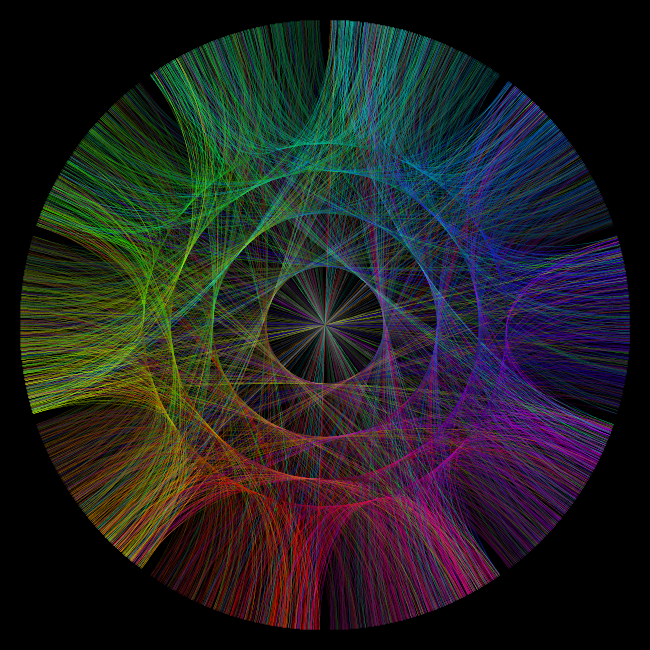
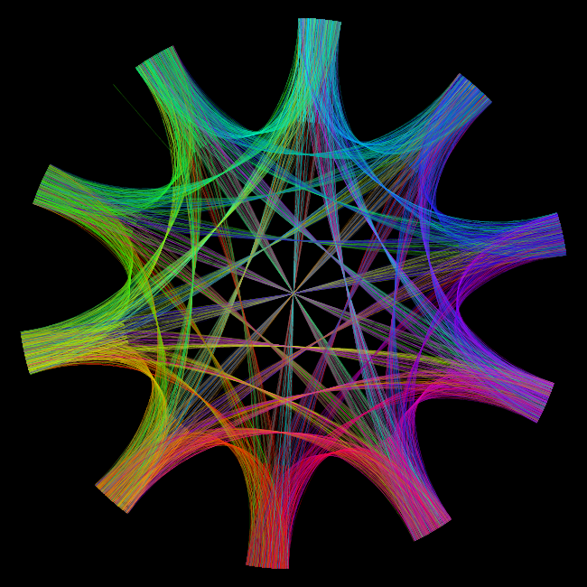
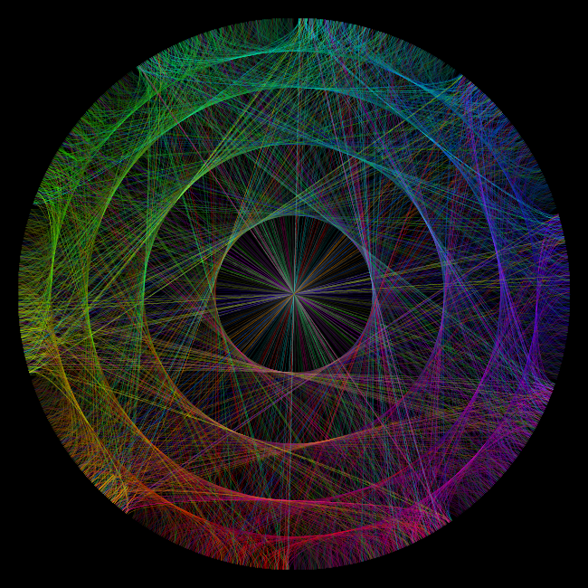
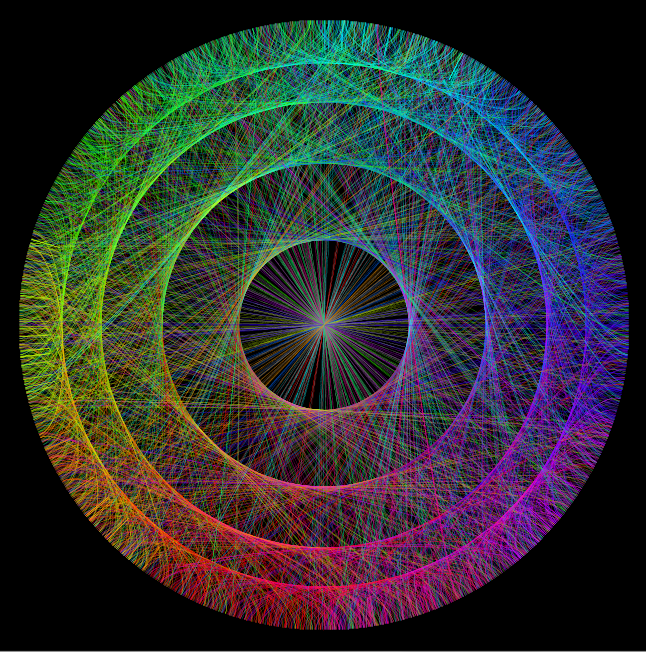

# PI_circle
Program napisany w Javie w środowisku graficznym Processing.  
Aby go skompilować wymagane jest środowisko.  
Plik 'pi.txt' przechowuje rozwinęcie dziesiętne PI  
  
Ideą programu była wizualizacja liczby PI,  
jednak nie można powiedzieć żeby efekt  
był z tą liczbą powiązany. Stopień  
przekształceń jest tak duży, że dokładnie  
taki sam efekt otrzymalibyśmy podstawiając  
do programu losowe cyfry.  
  
Program dzieli okrąg na 10 stref odpowiadających cyfrom,  
oraz łączy je krzywymi Beziera zgodnie z kolejnością  
tych cyfr w rozwinięciu liczby PI. Każda z części  
ma swój kolor, który przypisuje wszystkim łukom wychodzącym  
z niej.  
  
Działanie programu:  
- program dzieli okrąg na 10 części, od 0 do 9  
- wybiera część odpowiadającą pierwszej cyfrze rozwinęcia liczby PI  
- losuje punkt w obrębie tej części koła  
- wybiera część odpowiadającą kolejnej cyfrze rozwinęcia liczby PI  
- wybiera punkt w jej obrębie o tym samym przesunięciu względem  
 początku części co ten w p.3  
- łączy te dwa punkty krzywą Beziera o kotwicach leżęcych na promieniach  
 okręgu o końcach w tych punktach  
- wybiera nową część odpowiadającą kolejnej cyfrze rozwinęcia liczby PI  
- powtarza od p.3, dla ostatnio wybranej części (w p.4)  
  
Przykładowe efekty:  
  
  
  

